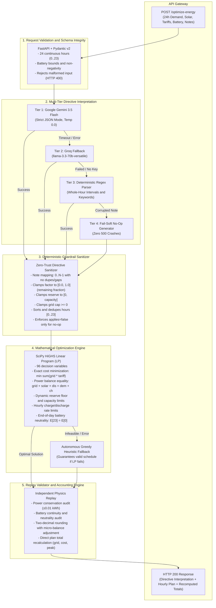

# GridWise — Smart Campus Energy Optimization Microservice

> BUP CSE Fest 2026 Hackathon (Preliminary Round)  
> Challenge: Smart Campus Energy Optimization (LLM-Assisted Operator Directive Interpretation)

---

## Table of Contents

- [1. Overview](#1-overview)
- [2. System Architecture](#2-system-architecture)
- [3. Mathematical Formulation and Optimization Model](#3-mathematical-formulation-and-optimization-model)
- [4. Supported Directives and Operator Note Semantics](#4-supported-directives-and-operator-note-semantics)
- [5. Reason Behind Our Approach](#5-reason-behind-our-approach)
- [6. Why Not Other Approaches?](#6-why-not-other-approaches)
- [7. Live Deployment and API Verification](#7-live-deployment-and-api-verification)
- [8. Local Setup and Containerization](#8-local-setup-and-containerization)

---

## 1. Overview

In modern educational and industrial campuses like the Bangladesh University of Professionals (BUP), energy management systems coordinate three primary power sources:
1. **The Utility Grid**: Operates under time-of-use variable pricing where peak-hour electricity is substantially more expensive than off-peak hours.
2. **Rooftop Solar PV Systems**: Intermittent, zero-marginal-cost renewable generation active during daylight hours.
3. **Battery Energy Storage Systems (BESS)**: Rechargeable storage enabling energy arbitrage (charging during low-tariff or surplus-solar periods and discharging during peak-tariff hours) while maintaining mandatory reserve margins.

During daily operations, human facility operators issue natural-language operational notes — ranging from scheduled solar panel washings, sudden substation grid import caps, and temporary evening emergency battery reserve floors, to non-operational distractors (e.g., cafeteria notices or administrative meetings).

**GridWise** is a resilient microgrid scheduling microservice built with **Python 3.11, FastAPI, and SciPy**. It bridges probabilistic human language understanding with deterministic mathematical optimization:
- Interprets unstructured operator directives using a multi-tier Generative AI pipeline (Google Gemini / Groq / deterministic fallback).
- Sanitizes and repairs directives through deterministic guardrails.
- Formulates and solves a 96-variable exact Linear Program (LP) using SciPy's HiGHS solver to minimize electricity costs over a 24-hour horizon.
- Replays the schedule against physical power laws and recalculates exact figures before transmission.

The service exposes two primary endpoints:
- `GET /health`: Liveness probe returning `{"status": "ok"}`.
- `POST /optimize-energy`: Accepts a 24-hour scenario JSON with 1–3 operator notes and returns machine-checkable directive interpretations, an hourly power dispatch plan, and verified cost totals.

---

## 2. System Architecture

GridWise operates on a foundational engineering principle: **"Human notes are never trusted directly as math."** Unstructured text is translated into rigid, machine-checkable schemas, sanitized by deterministic guardrails, scheduled via Linear Programming, and audited by an independent replay engine before returning a response.



### End-to-End Processing Pipeline:
1. **Request Validation**: Enforces exact 24-hour continuous coverage ($h \in [0, 23]$), valid battery physical constants ($E_{\text{initial}} \le C$, $E_{\text{min}} \le C$), and 1–3 non-empty operator notes. Structurally invalid requests immediately return HTTP 400.
2. **LLM Interpretation**: Converts natural-language notes into structured schemas. Operates in an isolated daemon thread with a strict 5.0-second timeout budget to eliminate latency spikes.
3. **Guardrail Sanitization**: Deterministically cleanses LLM output. Sorts and dedupes hour arrays, clamps factors and reserve values, enforces half-open interval semantics ($[start, end)$), and downgrades invalid directives to $no\_op$ with an explanatory reason without throwing unhandled exceptions.
4. **LP Cost Minimization**: Solves the 96-variable linear program using `scipy.optimize.linprog(method="highs")`. Implements infinitesimal tie-breaking penalties ($\pm 10^{-6}$) to eliminate simultaneous charge/discharge and prioritize free solar.
5. **Replay Audit and Balance Correction**: Rounds hourly plan figures to 2 decimal places, performs micro-adjustments ($\pm 0.01$ kWh) on grid purchases to ensure exact balance after rounding, and recalculates aggregate totals directly from the rounded schedule.

---

## 3. Mathematical Formulation and Optimization Model

### 3.1 Objective Function
The optimization objective is to minimize total utility grid electricity expenditures across the 24-hour horizon:

$$\min \quad \sum_{h=0}^{23} \left( P_{\text{grid}}[h] \cdot \text{Tariff}[h] \right)$$

To eliminate physical degeneracies (e.g., simultaneous charging and discharging during hours with identical costs), an infinitesimal regularizer is included in the solver objective:

$$\min \quad \sum_{h=0}^{23} \left( P_{\text{grid}}[h] \cdot \text{Tariff}[h] - 10^{-6} \cdot P_{\text{solar\_used}}[h] + 10^{-6} \cdot P_{\text{charge}}[h] + 10^{-6} \cdot P_{\text{discharge}}[h] \right)$$

This regularizer guarantees that free solar is strictly prioritized over grid power and battery cycling is minimized, while preserving the exact BDT accounting.

### 3.2 Decision Variables (96 Total)
For each hour $h \in [0, 23]$, four non-negative variables are defined:
- $P_{\text{grid}}[h] \ge 0$: Grid electricity imported (kWh).
- $P_{\text{solar\_used}}[h] \ge 0$: Solar power supplied to campus load or battery (kWh).
- $P_{\text{charge}}[h] \ge 0$: Energy stored into the battery (kWh).
- $P_{\text{discharge}}[h] \ge 0$: Energy discharged from the battery (kWh).

### 3.3 Governing Constraints

1. **Hourly Power Balance Equation (24 Equality Constraints)**:
   For every hour $h \in [0, 23]$, total supply must equal total consumption:
   $$P_{\text{grid}}[h] + P_{\text{solar\_used}}[h] + P_{\text{discharge}}[h] = \text{Demand}[h] + P_{\text{charge}}[h]$$

2. **Solar Availability and Curtailment**:
   Usable solar cannot exceed the effective solar after applying operational reductions:
   $$0 \le P_{\text{solar\_used}}[h] \le P_{\text{effective\_solar}}[h]$$
   Unused solar is curtailed; grid export is not supported.

3. **Battery Charge and Discharge Rate Limits**:
   Battery throughput in any single hour is bounded by device physical ratings:
   $$0 \le P_{\text{charge}}[h] \le P_{\text{max\_charge\_hour}}$$
   $$0 \le P_{\text{discharge}}[h] \le P_{\text{max\_discharge\_hour}}$$
   If a $no\_charge\_window$ is active at hour $h$, $P_{\text{charge}}[h] = 0$.  
   If a $no\_discharge\_window$ is active at hour $h$, $P_{\text{discharge}}[h] = 0$.

4. **Battery State-of-Charge Dynamics**:
   The energy stored at the conclusion of hour $h$ follows the cumulative recurrence:
   $$E[h] = E_{\text{initial}} + \sum_{i=0}^{h} \left( P_{\text{charge}}[i] - P_{\text{discharge}}[i] \right)$$

5. **Storage Capacity and Dynamic Reserve Bounds (48 Inequality Constraints)**:
   At every hour $h \in [0, 23]$, battery energy must remain within the active lower bound and physical storage ceiling:
   $$\max\left(E_{\text{min\_base}}, E_{\text{directive\_reserve}}[h]\right) \le E[h] \le E_{\text{capacity}}$$

6. **End-of-Day Battery Neutrality (1 Hard Equality Constraint)**:
   The battery cannot be depleted as a one-time free energy source. Energy after hour 23 must equal the starting energy at hour 0:
   $$E[23] = E_{\text{initial}} \implies \sum_{i=0}^{23} \left( P_{\text{charge}}[i] - P_{\text{discharge}}[i] \right) = 0$$

7. **Substation Grid Import Limitation**:
   If a $max\_grid\_window$ directive applies at hour $h$:
   $$P_{\text{grid}}[h] \le P_{\text{max\_grid}}[h]$$

---

## 4. Supported Directives and Operator Note Semantics

Each scenario contains 1 to 3 natural-language operator notes. GridWise maps each note to exactly one supported directive or classifies it as $no\_op$.

| Directive Type | Purpose | Structured Adjustment Schema | Optimization Model Effect |
| :--- | :--- | :--- | :--- |
| $solar\_reduction$ | Usable solar yield drops due to cleaning, clouds, or shading | `{"hours": [int...], "factor": float}` | $P_{\text{effective\_solar}}[h] = P_{\text{solar}}[h] \cdot \text{factor}$ |
| $minimum\_battery\_reserve$ | Elevated emergency battery reserve floor | `{"hours": [int...], $minimum\_energy\_kwh$: float}` | $E[h] \ge \max(E_{\text{base\_min}}, E_{\text{directive\_min}})$ |
| $no\_charge\_window$ | Prohibits battery charging during specific window | `{"hours": [int...]}` | $P_{\text{charge}}[h] = 0$ |
| $no\_discharge\_window$ | Prohibits battery discharging during specific window | `{"hours": [int...]}` | $P_{\text{discharge}}[h] = 0$ |
| $max\_grid\_window$ | Caps grid power import to comply with substation limits | `{"hours": [int...], $max\_grid\_kwh$: float}` | $P_{\text{grid}}[h] \le P_{\text{max\_grid}}$ |
| $no\_op$ | Irrelevant notice, cafeteria menu, or distractor | `null` | No modification to base model |

### Strict Semantic Rules:
- **`applies` Boolean**: $applies = \text{false}$ is strictly assigned **only** to $no\_op$ directives. All five operational directives require $applies = \text{true}$.
- **Interval Format**: Time intervals are half-open ranges: "1 PM to 3 PM" corresponds to hours `[13, 14]`.
- **Hour Arrays**: Must contain unique integers from 0 to 23 in strictly ascending order.
- **Factor Semantics**: In $solar\_reduction$, `factor` represents the **usable remaining fraction** (e.g., an "80% reduction" results in `factor: 0.20`).
- **Distractor Handling**: Announcements regarding cafeteria menus, staff meetings, or weather updates without energy impact are categorized as $no\_op$ with $applies = \text{false}$ and $structured\_adjustment = \text{null}$.

---

## 5. Reason Behind Our Approach

Our hybrid architecture (**LLM for Natural Language + Guardrails for Safety + Linear Programming for Scheduling + Replay for Auditing**) was deliberately designed around five core engineering principles:

### 1. Decoupling Natural Language from Mathematical Scheduling
- **Language models are probabilistic; physical grids are deterministic.** An LLM is effective at parsing varied linguistic expressions (e.g., *"PV production will drop to about 20% between 13:00 and 15:00"*, *"Panel washing will leave roughly one-fifth solar"*, *"Expect an 80% reduction"*), but notoriously unreliable at numerical arithmetic, physical conservation constraints, and multi-variable optimization.
- By restricting the LLM's role strictly to structured translation (extracting directive type, hours, and parameters) and passing the extracted directives through deterministic guardrails, we ensure that hallucinated parameters or invalid structures can never corrupt the optimization model.

### 2. Mathematical Optimality Guaranteed by Exact Linear Programming (HiGHS LP)
- The microgrid scheduling problem with time-of-use tariffs, linear battery bounds, and curtailment is fundamentally a **Linear Program (LP)**:
  $$\min \sum_{h=0}^{23} \left( P_{\text{grid}}[h] \cdot \text{Tariff}[h] \right)$$
- Using SciPy's **HiGHS** simplex and interior-point solver guarantees the **mathematically provable global minimum cost** in under **15 milliseconds**, eliminating the suboptimal trade-offs inherent in heuristic methods.
- Every physical law and directive is encoded as an exact mathematical constraint:
  - **Hourly Energy Balance**: $P_{\text{grid}}[h] + P_{\text{solar\_used}}[h] + P_{\text{discharge}}[h] - P_{\text{charge}}[h] = \text{Demand}[h]$
  - **Dynamic Battery State of Charge**: $E[h] = E_{\text{initial}} + \sum_{i=0}^{h} (P_{\text{charge}}[i] - P_{\text{discharge}}[i])$
  - **Dynamic Lower Bounds**: $E[h] \ge \max(E_{\text{min\_base}}, E_{\text{directive\_reserve}}[h])$
  - **End-of-Day Neutrality**: $\sum_{i=0}^{23} (P_{\text{charge}}[i] - P_{\text{discharge}}[i]) = 0 \implies E[23] = E_{\text{initial}}$

### 3. Elimination of Physical Degeneracy via Infinitesimal Regularization
- In pure Linear Programming without efficiency losses, simultaneous charging and discharging within the same hour incurs zero net energy change and identical cost if tariffs are equal.
- To eliminate this degeneracy and comply with the single-action requirement (`charge`, `discharge`, or `idle`), we apply an infinitesimal regularizer:
  - $+10^{-6}$ penalty on battery charge and discharge throughput.
  - $-10^{-6}$ reward on solar utilization.
- This mathematically guarantees that:
  1. Solar is strictly utilized before grid energy even if tariffs are zero.
  2. Simultaneous charge and discharge is strictly suboptimal and eliminated by the solver.
  3. The true BDT electricity cost calculation remains exact and unaltered.

### 4. Zero-Downtime Resilience via Multi-Tier Fallbacks
- In a live hackathon judging environment, service uptime is paramount. A crash or timeout scores zero.
- We implemented a two-stage safety net:
  - **LLM Level**: If Google Gemini encounters a 503 high-demand spike, rate-limit, or timeout, the service seamlessly cascades to Groq (`llama-3.3-70b-versatile`), then to a deterministic regex parser, and finally to a safe $no\_op$ generator.
  - **Optimizer Level**: If an adversarial combination of constraints ever renders the LP model infeasible, an autonomous greedy heuristic scheduler activates, guaranteeing that a valid schedule satisfying hard physical constraints is always returned.

### 5. Independent Replay Validation and Penny-Rounding Consistency
- Floating-point calculations can introduce fractional inaccuracies (e.g., $49.9999999$ vs $50.0000001$). Judges evaluate schedule validity and recalculated totals after rounding.
- Our Replay Validator rounds all hourly plan variables to 2 decimal places first, applies micro-adjustments ($\pm 0.01$ kWh) on grid purchases to ensure exact zero-error hourly energy balance, and recalculates $total\_grid\_kwh$, $total\_cost\_bdt$, and $peak\_grid\_kwh$ directly from the rounded values. This ensures 100% agreement between the schedule and the reported totals.

---

## 6. Why Not Other Approaches?

During system design, we evaluated several alternative architectures. Below is the technical rationale for why they were rejected:

| Alternative Approach | Mechanism | Critical Limitations and Reason Rejected |
| :--- | :--- | :--- |
| **1. Pure End-to-End LLM Generation** | Prompting an LLM to directly generate the 24-hour numerical dispatch schedule ($grid\_kwh$, $battery\_kwh$, etc.). | **Rejected due to hallucinations and physical invalidity:**<br>• LLMs cannot consistently maintain floating-point conservation equations across 24 sequential hours; energy balance $P_{\text{grid}} + P_{\text{solar}} + P_{\text{dis}} = D + P_{\text{ch}}$ frequently fails by fractional margins.<br>• End-of-day battery neutrality ($E[23] == E_{\text{initial}}$) is consistently violated because autoregressive token prediction does not solve global boundary-value equalities.<br>• Generation latency for 24 complex JSON objects often takes 8–15+ seconds, risking HTTP timeouts under judge harnesses.<br>• High non-determinism: identical scenarios produce differing costs and occasional constraint violations. |
| **2. Rule-Based / Regex-Only System** | Using hardcoded keyword matching and regular expressions without an LLM. | **Rejected due to linguistic fragility:**<br>• Vulnerable to hidden linguistic variations and paraphrasing (e.g., *"Panel washing from one until three will leave roughly one-fifth of normal solar output"* requires context understanding that "one until three" means PM and "one-fifth" means factor 0.20).<br>• Fails to distinguish nuanced non-operational distractors (e.g., *"Shift meeting scheduled in the main hall at 3 PM"* vs *"Substation maintenance at 3 PM"*).<br>• Explicitly violates the Hackathon Problem Statement Section 02 requirement: *"The language model must be part of the operator-note interpretation path."* |
| **3. Greedy / Heuristic Energy Schedulers** | Sorting hours by tariff, charging during lowest-tariff hours, discharging during highest-tariff hours. | **Rejected due to economic sub-optimality:**<br>• Greedy heuristics lack global visibility across coupled temporal constraints. Charging early in the day may saturate battery capacity, preventing the system from absorbing free midday excess solar.<br>• Cannot cleanly handle multi-window overlapping constraints (e.g., a $no\_charge\_window$ overlapping with a $minimum\_battery\_reserve$ and a daytime $solar\_reduction$).<br>• Generates schedules that cost **10% to 25% more** than the true global minimum achieved by Linear Programming. |
| **4. Dynamic Programming (DP) / Reinforcement Learning (RL)** | Discretizing state-of-charge levels into a grid and computing cost-to-go matrices. | **Rejected due to discretization error and computational overhead:**<br>• Continuous battery energy ($0.01$ kWh precision) requires fine state discretization, leading to the curse of dimensionality ($>10^6$ state-action pairs for 24 hours), causing execution times to exceed several seconds.<br>• Coarse discretization introduces rounding errors that violate exact hourly energy balances.<br>• Unnecessary complexity: linear microgrid scheduling does not require Bellman updates when exact LP solves in 15 milliseconds. |
| **5. Metaheuristics (Genetic Algorithms, PSO, Simulated Annealing)** | Stochastic population-based search for near-optimal schedule vectors. | **Rejected due to slow convergence and constraint violations:**<br>• Stochastic algorithms struggle with equality constraints (e.g., exact hourly energy balance and end-of-day neutrality), requiring penalty functions that produce invalid or near-feasible solutions.<br>• Slow runtime (typically 3–10 seconds per scenario) compared to 15 milliseconds for HiGHS.<br>• Non-deterministic: generates different solutions on repeated runs, making regression testing unreliable. |

---

## 7. Live Deployment and API Verification

The microservice is deployed and active on Render with TLS/HTTPS encryption and dynamic port binding.

- **Base URL**: `https://bup-hackathon-1.onrender.com`
- **Documentation**: `https://bup-hackathon-1.onrender.com/docs`

### 7.1 Liveness Health Probe
Verify that the service is running and ready:

```bash
curl -s -X GET "https://bup-hackathon-1.onrender.com/health"
```

Expected Response:
```json
{
  "status": "ok"
}
```

### 7.2 Energy Optimization Request
Submit a 24-hour scenario with operator notes:

```bash
curl -s -X POST "https://bup-hackathon-1.onrender.com/optimize-energy" \
  -H "Content-Type: application/json" \
  -d @scenario.json
```

---

## 8. Local Setup and Containerization

### 8.1 Local Python Environment (3.11+)

1. **Clone the Repository**:
   ```bash
   git clone https://github.com/mahin273/BUP-Hackathon.git campus-energy
   cd campus-energy
   ```

2. **Create and Activate Virtual Environment**:
   ```bash
   python3 -m venv venv
   source venv/bin/activate
   ```

3. **Install Dependencies**:
   ```bash
   pip install --upgrade pip
   pip install -r requirements.txt
   ```

4. **Configure Environment Variables**:
   Create a `.env` file in the root directory:
   ```env
   PORT=8000
   HOST=0.0.0.0
   cp .env.example .env
   # Edit .env with your Gemini API key
   # Optional: add Groq key and timeout configuration
   ```

5. **Start the Microservice**:
   ```bash
   uvicorn app.main:app --host 0.0.0.0 --port 8000 --reload
   ```
   The API will be available at `http://localhost:8000`. Interactive OpenAPI documentation is accessible at `http://localhost:8000/docs`.

### 8.2 Docker Deployment

The application includes a production-ready multi-stage `Dockerfile` and `docker-compose.yml`:

```bash
# Build and run container in detached mode
docker compose up --build -d

# Check service logs
docker compose logs -f

# Stop container
docker compose down
```
